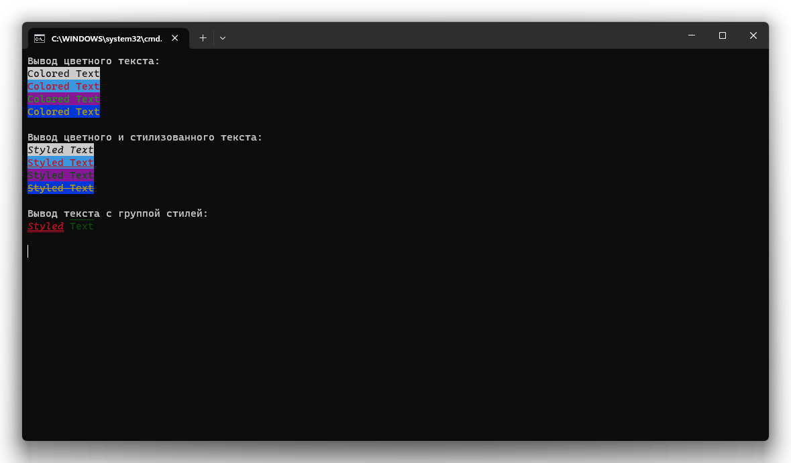

# StyledPrinter
**StyledPrinter** – это модуль для вывода цветного и стилизованного текста в терминал с возможностью автосброса стилей и отключения перехода на новую строку.

## Классы
* `Styles` – содержит два контейнера: для декораций и стилей.
* `StylesGroup` – предоставляет возможность комбинировать стили для их однократной инициализации и повторного использования. При интерпретации в `str()` предоставляет строковый маркер стилей.

## Функции
* `StyledPrinter(Text: str, Styles: StylesGroup | None = None, Decorations: list[Styles.Decoration] = list(), TextColor: Styles.Color | None = None, BackgroundColor: Styles.Color | None = None, Autoreset: bool = True, Newline: bool = True)` – выводит в терминал цветной и стилизованный текст с возможностью отключения автоматического сброса стилей к стандартным и перехода на новую строку.
* `TextStyler(Text: str, Styles: StylesGroup | None = None, Decorations: list[Styles.Decoration] = list(), TextColor: Styles.Color | None = None, BackgroundColor: Styles.Color | None = None, Autoreset: bool = True) -> str` – возвращает стилизованный текст.

> [!WARNING]
> Не используйте одновременно группу стилей и отдельные стили, так как это приводит к ошибке переопределения.

## Пример
```Python
from dublib.StyledPrinter import *

# Вывод цветного текста.
StyledPrinter("Colored Text", TextColor = Styles.Color.Red)

# Вывод цветного текста на фоне.
StyledPrinter("Colored Text on Background", TextColor = Styles.Color.Red, BackgroundColor = Styles.Color.White)

# Вывод стилизованного цветного текста на фоне.
StyledPrinter("Colored Text", Decorations = [Styles.Decoration.Italic], TextColor = Styles.Color.Purple, BackgroundColor = Styles.Color.Yellow)

# Вывод стилизованного цветного текста на фоне c отключением сброса стилей к стандартным.
StyledPrinter("Colored Text", Decorations = [Styles.Decoration.Italic], TextColor = Styles.Color.Purple, BackgroundColor = Styles.Color.Yellow, Autoreset = True)

# Вывод стилизованного цветного текста на фоне с отключением сброса стилей к стандартным и перехода на новую строку.
StyledPrinter("Colored Text", Decorations = [Styles.Decoration.Italic], TextColor = Styles.Color.Purple, BackgroundColor = Styles.Color.Yellow, Autoreset = True, Newline = False)

# Создание группы стилей.
GroupOfStyles = StylesGroup(Decorations = [Styles.Decoration.Italic], TextColor = Styles.Color.Purple, BackgroundColor = Styles.Color.Yellow)

# Вывод стилизованного цветного текста на фоне (при помощи группы стилей) с отключением сброса стилей к стандартным и перехода на новую строку.
StyledPrinter("Colored Text", GroupOfStyles, Autoreset = True, Newline = False)

# Создание стилизованного текста (при помощи группы стилей) для использования в стандартном методе вывода.
StyledText = TextStyler("Colored Text", GroupOfStyles)

# Вывод стилизованного текста стандартным методом.
print(StyledText)
```

## Скриншот
